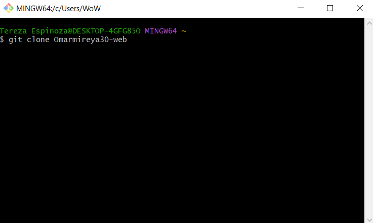

# Repositorio de trabajo del módulo de Periodismo de Datos II

En este repositorio se guardan todas las actividades realizadas durante el curso de Periodismo de Datos II: Herramientas para la visualización y presentación de datos, dictada por el profesor Adolfo Antón Bravo para el Máster de Periodismo Digital y de Datos, versión online. 

En esta materia se aprendió a usar la **sintaxis Markdown** en el repositorio de *GitHub*, ambos desconocidos para mi personas. Además, aprendimos a usar *Jupiter* con el lenguaje **Phyton** para escrapear datos de páginas web, cómo extraerlos y presentarlos tanto en tabla como en gráficos. 

Los que no teníamos conocimientos en el uso de terminales para verificar el estado de nuestra PC, en este módulo adquirimos los conocimientos básicos.

En este sentido puedo mencionar que aprendimos a usar la interfaz del ordenador empleando el ***Git Bash*** para clonar el repositorio [Omarmireya30-web](https://nebrijas.github.io/Omarmireya30-web/) usando el comando **pw** y posteriormente **git clone**

## Algunos de los comandos que se usaron fueron

- pwd: Se usa para imprimir el directorio de trabajo

- cd: Se usa para hacer una correcta automatización del proceso

- ls: Nos permite listar el contenido del directorio 

- git init: Puede utilizarse para convertir un proyecto existente y sin versión en un repositorio de Git, o para inicializar un nuevo repositorio vacío.

- git push: Se usa para cargar contenido del repositorio local a un repositorio remoto.

- git pull: Se emplea para extraer y descargar contenido desde un repositorio remoto y actualizar al instante el repositorio local para reflejar ese contenido.

Posteriormente empezamos a trabajar en Jupyter usando sintaxis markdown y phyton, allí realizamos las actividades dirigidas 3 y 4, para luego a través del git bash direccioinarla al GitHub. 

En Jupyter importamos e instalamos las librerias de **Phyton** conocimos sobre el ***data frame*** (df) que es una estructura usada para manejar un conjunto de datos. Tambien aprendimos a usar el **Pure Data** (pd) para trabajar gráficos. 

Algunas dificultades que enfrenté fue el no encontra el directorio cuando ingresaba el pwd, sin embargo, esto se solucionó usando el comando ***dir*** y posteriormente haciendo el llamado al directorio, para continuar con las indicaciones del profesor.  

Puedo concluir que la materia **ha sido de gran provecho en el uso de herramientas de búsqueda y visualización de datos** que antes no conocíamos y ahora podremos poner en práctica. 

Dicho esto presento las actividades realizadas. 

## Actividades dirigidas 

-[Actividad dirigida 1](ad1.md)

-[Actividad dirigida 2](ad2.md)

-[Actividad dirigida 3](aad3..ipynb)

-[Actividad dirigida 4 en ipynb](add4.ipynb)

-[Actividad dirigida 4 en md](add4.md)
