## AD4: Conexión con la API del COVID19 y análsisi con Pandas

Me conecto a la api https://covid19api.com/ para extraer información de los países.


```python
!pip install pandas
```

    Requirement already satisfied: pandas in c:\users\wow\anaconda3\lib\site-packages (1.4.2)
    Requirement already satisfied: python-dateutil>=2.8.1 in c:\users\wow\anaconda3\lib\site-packages (from pandas) (2.8.2)
    Requirement already satisfied: numpy>=1.18.5 in c:\users\wow\anaconda3\lib\site-packages (from pandas) (1.21.5)
    Requirement already satisfied: pytz>=2020.1 in c:\users\wow\anaconda3\lib\site-packages (from pandas) (2021.3)
    Requirement already satisfied: six>=1.5 in c:\users\wow\anaconda3\lib\site-packages (from python-dateutil>=2.8.1->pandas) (1.16.0)
    


```python
import pandas as pd
```

Crearemos un objeto con la variable URL donde están los países

## Creamos Variable


```python
url = 'https://api.covid19api.com/countries'
```

Con esta URL obtendremos los datos del comportamiento de la COVID19 a nivel mundial
Estos mismos datos seran usados mas adelante para hacer graficos comparativos. Por lo que ahora procedemos a invocar la url.


```python
url
```


    'https://api.covid19api.com/countries'


Ahora haremos la función read json que es la variable antes creada, o sea la url.


```python
df= pd.read_json(url)
```

Invocaremos el data france frame para comprobar de que la funcion ha sido correcta


```python
df
```


<div>
<style scoped>
    .dataframe tbody tr th:only-of-type {
        vertical-align: middle;
    }

    .dataframe tbody tr th {
        vertical-align: top;
    }

    .dataframe thead th {
        text-align: right;
    }
</style>
<table border="1" class="dataframe">
  <thead>
    <tr style="text-align: right;">
      <th></th>
      <th>Country</th>
      <th>Slug</th>
      <th>ISO2</th>
    </tr>
  </thead>
  <tbody>
    <tr>
      <th>0</th>
      <td>Gibraltar</td>
      <td>gibraltar</td>
      <td>GI</td>
    </tr>
    <tr>
      <th>1</th>
      <td>Oman</td>
      <td>oman</td>
      <td>OM</td>
    </tr>
    <tr>
      <th>2</th>
      <td>France</td>
      <td>france</td>
      <td>FR</td>
    </tr>
    <tr>
      <th>3</th>
      <td>Jersey</td>
      <td>jersey</td>
      <td>JE</td>
    </tr>
    <tr>
      <th>4</th>
      <td>Mali</td>
      <td>mali</td>
      <td>ML</td>
    </tr>
    <tr>
      <th>...</th>
      <td>...</td>
      <td>...</td>
      <td>...</td>
    </tr>
    <tr>
      <th>243</th>
      <td>Puerto Rico</td>
      <td>puerto-rico</td>
      <td>PR</td>
    </tr>
    <tr>
      <th>244</th>
      <td>Papua New Guinea</td>
      <td>papua-new-guinea</td>
      <td>PG</td>
    </tr>
    <tr>
      <th>245</th>
      <td>Saint Pierre and Miquelon</td>
      <td>saint-pierre-and-miquelon</td>
      <td>PM</td>
    </tr>
    <tr>
      <th>246</th>
      <td>Timor-Leste</td>
      <td>timor-leste</td>
      <td>TL</td>
    </tr>
    <tr>
      <th>247</th>
      <td>Montenegro</td>
      <td>montenegro</td>
      <td>ME</td>
    </tr>
  </tbody>
</table>
<p>248 rows × 3 columns</p>
</div>


Luego de comprobar que el data frame funciona entonces empezamos a extraer datos de los países. Primero lo haremos con España.


```python
df [df['Country']=='Spain']
```


<div>
<style scoped>
    .dataframe tbody tr th:only-of-type {
        vertical-align: middle;
    }

    .dataframe tbody tr th {
        vertical-align: top;
    }

    .dataframe thead th {
        text-align: right;
    }
</style>
<table border="1" class="dataframe">
  <thead>
    <tr style="text-align: right;">
      <th></th>
      <th>Country</th>
      <th>Slug</th>
      <th>ISO2</th>
    </tr>
  </thead>
  <tbody>
    <tr>
      <th>141</th>
      <td>Spain</td>
      <td>spain</td>
      <td>ES</td>
    </tr>
  </tbody>
</table>
</div>


Ahora haremos lo mismo con Panamá


```python
df[df['Country']=='Panama']
```


<div>
<style scoped>
    .dataframe tbody tr th:only-of-type {
        vertical-align: middle;
    }

    .dataframe tbody tr th {
        vertical-align: top;
    }

    .dataframe thead th {
        text-align: right;
    }
</style>
<table border="1" class="dataframe">
  <thead>
    <tr style="text-align: right;">
      <th></th>
      <th>Country</th>
      <th>Slug</th>
      <th>ISO2</th>
    </tr>
  </thead>
  <tbody>
    <tr>
      <th>190</th>
      <td>Panama</td>
      <td>panama</td>
      <td>PA</td>
    </tr>
  </tbody>
</table>
</div>


Seguidamente creamos otra variable con una url que contenga los casos de COVID19 confirmados. Para diferenciar las url o variables nombramos el json url_rt_es. En este caso usamos las siglas **es** pertenecnientes a España, en otros casos utilizamos las correspondientes a los paises que deseemos explorar. 


```python
url_rt_es= 'https://api.covid19api.com/country/spain/status/confirmed/live'
df_rt_es= pd.read_json(url_rt_es)
df_rt_es
```


<div>
<style scoped>
    .dataframe tbody tr th:only-of-type {
        vertical-align: middle;
    }

    .dataframe tbody tr th {
        vertical-align: top;
    }

    .dataframe thead th {
        text-align: right;
    }
</style>
<table border="1" class="dataframe">
  <thead>
    <tr style="text-align: right;">
      <th></th>
      <th>Country</th>
      <th>CountryCode</th>
      <th>Province</th>
      <th>City</th>
      <th>CityCode</th>
      <th>Lat</th>
      <th>Lon</th>
      <th>Cases</th>
      <th>Status</th>
      <th>Date</th>
    </tr>
  </thead>
  <tbody>
    <tr>
      <th>0</th>
      <td>Spain</td>
      <td>ES</td>
      <td></td>
      <td></td>
      <td></td>
      <td>40.46</td>
      <td>-3.75</td>
      <td>0</td>
      <td>confirmed</td>
      <td>2020-01-22 00:00:00+00:00</td>
    </tr>
    <tr>
      <th>1</th>
      <td>Spain</td>
      <td>ES</td>
      <td></td>
      <td></td>
      <td></td>
      <td>40.46</td>
      <td>-3.75</td>
      <td>0</td>
      <td>confirmed</td>
      <td>2020-01-23 00:00:00+00:00</td>
    </tr>
    <tr>
      <th>2</th>
      <td>Spain</td>
      <td>ES</td>
      <td></td>
      <td></td>
      <td></td>
      <td>40.46</td>
      <td>-3.75</td>
      <td>0</td>
      <td>confirmed</td>
      <td>2020-01-24 00:00:00+00:00</td>
    </tr>
    <tr>
      <th>3</th>
      <td>Spain</td>
      <td>ES</td>
      <td></td>
      <td></td>
      <td></td>
      <td>40.46</td>
      <td>-3.75</td>
      <td>0</td>
      <td>confirmed</td>
      <td>2020-01-25 00:00:00+00:00</td>
    </tr>
    <tr>
      <th>4</th>
      <td>Spain</td>
      <td>ES</td>
      <td></td>
      <td></td>
      <td></td>
      <td>40.46</td>
      <td>-3.75</td>
      <td>0</td>
      <td>confirmed</td>
      <td>2020-01-26 00:00:00+00:00</td>
    </tr>
    <tr>
      <th>...</th>
      <td>...</td>
      <td>...</td>
      <td>...</td>
      <td>...</td>
      <td>...</td>
      <td>...</td>
      <td>...</td>
      <td>...</td>
      <td>...</td>
      <td>...</td>
    </tr>
    <tr>
      <th>892</th>
      <td>Spain</td>
      <td>ES</td>
      <td></td>
      <td></td>
      <td></td>
      <td>40.46</td>
      <td>-3.75</td>
      <td>12818184</td>
      <td>confirmed</td>
      <td>2022-07-02 00:00:00+00:00</td>
    </tr>
    <tr>
      <th>893</th>
      <td>Spain</td>
      <td>ES</td>
      <td></td>
      <td></td>
      <td></td>
      <td>40.46</td>
      <td>-3.75</td>
      <td>12818184</td>
      <td>confirmed</td>
      <td>2022-07-03 00:00:00+00:00</td>
    </tr>
    <tr>
      <th>894</th>
      <td>Spain</td>
      <td>ES</td>
      <td></td>
      <td></td>
      <td></td>
      <td>40.46</td>
      <td>-3.75</td>
      <td>12818184</td>
      <td>confirmed</td>
      <td>2022-07-04 00:00:00+00:00</td>
    </tr>
    <tr>
      <th>895</th>
      <td>Spain</td>
      <td>ES</td>
      <td></td>
      <td></td>
      <td></td>
      <td>40.46</td>
      <td>-3.75</td>
      <td>12890002</td>
      <td>confirmed</td>
      <td>2022-07-05 00:00:00+00:00</td>
    </tr>
    <tr>
      <th>896</th>
      <td>Spain</td>
      <td>ES</td>
      <td></td>
      <td></td>
      <td></td>
      <td>40.46</td>
      <td>-3.75</td>
      <td>12890002</td>
      <td>confirmed</td>
      <td>2022-07-06 00:00:00+00:00</td>
    </tr>
  </tbody>
</table>
<p>897 rows × 10 columns</p>
</div>


Ahora buscaremos los datos de Panamá 


```python
url_rt_pa= 'https://api.covid19api.com/country/panama/status/confirmed/live'
df_rt_pa= pd.read_json(url_rt_pa)
df_rt_pa
```


<div>
<style scoped>
    .dataframe tbody tr th:only-of-type {
        vertical-align: middle;
    }

    .dataframe tbody tr th {
        vertical-align: top;
    }

    .dataframe thead th {
        text-align: right;
    }
</style>
<table border="1" class="dataframe">
  <thead>
    <tr style="text-align: right;">
      <th></th>
      <th>Country</th>
      <th>CountryCode</th>
      <th>Province</th>
      <th>City</th>
      <th>CityCode</th>
      <th>Lat</th>
      <th>Lon</th>
      <th>Cases</th>
      <th>Status</th>
      <th>Date</th>
    </tr>
  </thead>
  <tbody>
    <tr>
      <th>0</th>
      <td>Panama</td>
      <td>PA</td>
      <td></td>
      <td></td>
      <td></td>
      <td>8.54</td>
      <td>-80.78</td>
      <td>0</td>
      <td>confirmed</td>
      <td>2020-01-22 00:00:00+00:00</td>
    </tr>
    <tr>
      <th>1</th>
      <td>Panama</td>
      <td>PA</td>
      <td></td>
      <td></td>
      <td></td>
      <td>8.54</td>
      <td>-80.78</td>
      <td>0</td>
      <td>confirmed</td>
      <td>2020-01-23 00:00:00+00:00</td>
    </tr>
    <tr>
      <th>2</th>
      <td>Panama</td>
      <td>PA</td>
      <td></td>
      <td></td>
      <td></td>
      <td>8.54</td>
      <td>-80.78</td>
      <td>0</td>
      <td>confirmed</td>
      <td>2020-01-24 00:00:00+00:00</td>
    </tr>
    <tr>
      <th>3</th>
      <td>Panama</td>
      <td>PA</td>
      <td></td>
      <td></td>
      <td></td>
      <td>8.54</td>
      <td>-80.78</td>
      <td>0</td>
      <td>confirmed</td>
      <td>2020-01-25 00:00:00+00:00</td>
    </tr>
    <tr>
      <th>4</th>
      <td>Panama</td>
      <td>PA</td>
      <td></td>
      <td></td>
      <td></td>
      <td>8.54</td>
      <td>-80.78</td>
      <td>0</td>
      <td>confirmed</td>
      <td>2020-01-26 00:00:00+00:00</td>
    </tr>
    <tr>
      <th>...</th>
      <td>...</td>
      <td>...</td>
      <td>...</td>
      <td>...</td>
      <td>...</td>
      <td>...</td>
      <td>...</td>
      <td>...</td>
      <td>...</td>
      <td>...</td>
    </tr>
    <tr>
      <th>893</th>
      <td>Panama</td>
      <td>PA</td>
      <td></td>
      <td></td>
      <td></td>
      <td>8.54</td>
      <td>-80.78</td>
      <td>925254</td>
      <td>confirmed</td>
      <td>2022-07-03 00:00:00+00:00</td>
    </tr>
    <tr>
      <th>894</th>
      <td>Panama</td>
      <td>PA</td>
      <td></td>
      <td></td>
      <td></td>
      <td>8.54</td>
      <td>-80.78</td>
      <td>925254</td>
      <td>confirmed</td>
      <td>2022-07-04 00:00:00+00:00</td>
    </tr>
    <tr>
      <th>895</th>
      <td>Panama</td>
      <td>PA</td>
      <td></td>
      <td></td>
      <td></td>
      <td>8.54</td>
      <td>-80.78</td>
      <td>925254</td>
      <td>confirmed</td>
      <td>2022-07-05 00:00:00+00:00</td>
    </tr>
    <tr>
      <th>896</th>
      <td>Panama</td>
      <td>PA</td>
      <td></td>
      <td></td>
      <td></td>
      <td>8.54</td>
      <td>-80.78</td>
      <td>925254</td>
      <td>confirmed</td>
      <td>2022-07-06 00:00:00+00:00</td>
    </tr>
    <tr>
      <th>897</th>
      <td>Panama</td>
      <td>PA</td>
      <td></td>
      <td></td>
      <td></td>
      <td>8.54</td>
      <td>-80.78</td>
      <td>925254</td>
      <td>confirmed</td>
      <td>2022-07-07 00:00:00+00:00</td>
    </tr>
  </tbody>
</table>
<p>898 rows × 10 columns</p>
</div>


### Vemos que en este caso se cambio el nombre del país en la url y las sigas en el data frame

En caso de que queramos ver solo la cabecera de la tabla entonces hacemos la siguiente función 


```python
df_rt_es.head()
```


<div>
<style scoped>
    .dataframe tbody tr th:only-of-type {
        vertical-align: middle;
    }

    .dataframe tbody tr th {
        vertical-align: top;
    }

    .dataframe thead th {
        text-align: right;
    }
</style>
<table border="1" class="dataframe">
  <thead>
    <tr style="text-align: right;">
      <th></th>
      <th>Country</th>
      <th>CountryCode</th>
      <th>Province</th>
      <th>City</th>
      <th>CityCode</th>
      <th>Lat</th>
      <th>Lon</th>
      <th>Cases</th>
      <th>Status</th>
      <th>Date</th>
    </tr>
  </thead>
  <tbody>
    <tr>
      <th>0</th>
      <td>Spain</td>
      <td>ES</td>
      <td></td>
      <td></td>
      <td></td>
      <td>40.46</td>
      <td>-3.75</td>
      <td>0</td>
      <td>confirmed</td>
      <td>2020-01-22 00:00:00+00:00</td>
    </tr>
    <tr>
      <th>1</th>
      <td>Spain</td>
      <td>ES</td>
      <td></td>
      <td></td>
      <td></td>
      <td>40.46</td>
      <td>-3.75</td>
      <td>0</td>
      <td>confirmed</td>
      <td>2020-01-23 00:00:00+00:00</td>
    </tr>
    <tr>
      <th>2</th>
      <td>Spain</td>
      <td>ES</td>
      <td></td>
      <td></td>
      <td></td>
      <td>40.46</td>
      <td>-3.75</td>
      <td>0</td>
      <td>confirmed</td>
      <td>2020-01-24 00:00:00+00:00</td>
    </tr>
    <tr>
      <th>3</th>
      <td>Spain</td>
      <td>ES</td>
      <td></td>
      <td></td>
      <td></td>
      <td>40.46</td>
      <td>-3.75</td>
      <td>0</td>
      <td>confirmed</td>
      <td>2020-01-25 00:00:00+00:00</td>
    </tr>
    <tr>
      <th>4</th>
      <td>Spain</td>
      <td>ES</td>
      <td></td>
      <td></td>
      <td></td>
      <td>40.46</td>
      <td>-3.75</td>
      <td>0</td>
      <td>confirmed</td>
      <td>2020-01-26 00:00:00+00:00</td>
    </tr>
  </tbody>
</table>
</div>


Y si solo quisiera ver el final de la tabla cambiamos a:


```python
df_rt_es.tail()
```


<div>
<style scoped>
    .dataframe tbody tr th:only-of-type {
        vertical-align: middle;
    }

    .dataframe tbody tr th {
        vertical-align: top;
    }

    .dataframe thead th {
        text-align: right;
    }
</style>
<table border="1" class="dataframe">
  <thead>
    <tr style="text-align: right;">
      <th></th>
      <th>Country</th>
      <th>CountryCode</th>
      <th>Province</th>
      <th>City</th>
      <th>CityCode</th>
      <th>Lat</th>
      <th>Lon</th>
      <th>Cases</th>
      <th>Status</th>
      <th>Date</th>
    </tr>
  </thead>
  <tbody>
    <tr>
      <th>892</th>
      <td>Spain</td>
      <td>ES</td>
      <td></td>
      <td></td>
      <td></td>
      <td>40.46</td>
      <td>-3.75</td>
      <td>12818184</td>
      <td>confirmed</td>
      <td>2022-07-02 00:00:00+00:00</td>
    </tr>
    <tr>
      <th>893</th>
      <td>Spain</td>
      <td>ES</td>
      <td></td>
      <td></td>
      <td></td>
      <td>40.46</td>
      <td>-3.75</td>
      <td>12818184</td>
      <td>confirmed</td>
      <td>2022-07-03 00:00:00+00:00</td>
    </tr>
    <tr>
      <th>894</th>
      <td>Spain</td>
      <td>ES</td>
      <td></td>
      <td></td>
      <td></td>
      <td>40.46</td>
      <td>-3.75</td>
      <td>12818184</td>
      <td>confirmed</td>
      <td>2022-07-04 00:00:00+00:00</td>
    </tr>
    <tr>
      <th>895</th>
      <td>Spain</td>
      <td>ES</td>
      <td></td>
      <td></td>
      <td></td>
      <td>40.46</td>
      <td>-3.75</td>
      <td>12890002</td>
      <td>confirmed</td>
      <td>2022-07-05 00:00:00+00:00</td>
    </tr>
    <tr>
      <th>896</th>
      <td>Spain</td>
      <td>ES</td>
      <td></td>
      <td></td>
      <td></td>
      <td>40.46</td>
      <td>-3.75</td>
      <td>12890002</td>
      <td>confirmed</td>
      <td>2022-07-06 00:00:00+00:00</td>
    </tr>
  </tbody>
</table>
</div>


### Luego de creadas las vairbles y verificado los datos de Panama y Espana entonces podemos hacer graficos y comparativas 

Tras analizar los datos proporcionados por la tabla, procedemos a plotear los que nos interesan, en este caso fecha y casos. Iniciamos con España, creando ademas el objeto casos_es.


```python
casos_es= df_rt_es.set_index('Date')['Cases']
casos_es.plot(title="Casos de Covid19 en España")
```


    <AxesSubplot:title={'center':'Casos de Covid19 en España'}, xlabel='Date'>


    
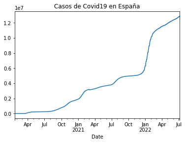
    


```python
casos_es
```


    Date
    2020-01-22 00:00:00+00:00           0
    2020-01-23 00:00:00+00:00           0
    2020-01-24 00:00:00+00:00           0
    2020-01-25 00:00:00+00:00           0
    2020-01-26 00:00:00+00:00           0
                                   ...   
    2022-07-02 00:00:00+00:00    12818184
    2022-07-03 00:00:00+00:00    12818184
    2022-07-04 00:00:00+00:00    12818184
    2022-07-05 00:00:00+00:00    12890002
    2022-07-06 00:00:00+00:00    12890002
    Name: Cases, Length: 897, dtype: int64


Haremos lo mismo con los datos de Panamá, por lo que solo tendremos que cambiar las siglas de los países


```python
casos_pa = df_rt_pa.set_index('Date')['Cases']
casos_pa.plot(title="Casos de Covid19 en Panama")
```


    <AxesSubplot:title={'center':'Casos de Covid19 en Panama'}, xlabel='Date'>


    
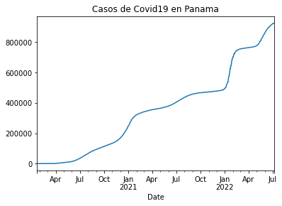
    


```python
casos_pa
```


    Date
    2020-01-22 00:00:00+00:00         0
    2020-01-23 00:00:00+00:00         0
    2020-01-24 00:00:00+00:00         0
    2020-01-25 00:00:00+00:00         0
    2020-01-26 00:00:00+00:00         0
                                  ...  
    2022-07-03 00:00:00+00:00    925254
    2022-07-04 00:00:00+00:00    925254
    2022-07-05 00:00:00+00:00    925254
    2022-07-06 00:00:00+00:00    925254
    2022-07-07 00:00:00+00:00    925254
    Name: Cases, Length: 898, dtype: int64


## Concatenar 

Ahora concatenaremos la informacion de los dos países, España y Panamá con la funcion concat. De esta forma veremos las comparativas de ambas naciones. 


```python
pa_vs_es= pd.concat([casos_es,casos_pa],axis=1)
pa_vs_es

```


<div>
<style scoped>
    .dataframe tbody tr th:only-of-type {
        vertical-align: middle;
    }

    .dataframe tbody tr th {
        vertical-align: top;
    }

    .dataframe thead th {
        text-align: right;
    }
</style>
<table border="1" class="dataframe">
  <thead>
    <tr style="text-align: right;">
      <th></th>
      <th>Cases</th>
      <th>Cases</th>
    </tr>
    <tr>
      <th>Date</th>
      <th></th>
      <th></th>
    </tr>
  </thead>
  <tbody>
    <tr>
      <th>2020-01-22 00:00:00+00:00</th>
      <td>0.0</td>
      <td>0</td>
    </tr>
    <tr>
      <th>2020-01-23 00:00:00+00:00</th>
      <td>0.0</td>
      <td>0</td>
    </tr>
    <tr>
      <th>2020-01-24 00:00:00+00:00</th>
      <td>0.0</td>
      <td>0</td>
    </tr>
    <tr>
      <th>2020-01-25 00:00:00+00:00</th>
      <td>0.0</td>
      <td>0</td>
    </tr>
    <tr>
      <th>2020-01-26 00:00:00+00:00</th>
      <td>0.0</td>
      <td>0</td>
    </tr>
    <tr>
      <th>...</th>
      <td>...</td>
      <td>...</td>
    </tr>
    <tr>
      <th>2022-07-03 00:00:00+00:00</th>
      <td>12818184.0</td>
      <td>925254</td>
    </tr>
    <tr>
      <th>2022-07-04 00:00:00+00:00</th>
      <td>12818184.0</td>
      <td>925254</td>
    </tr>
    <tr>
      <th>2022-07-05 00:00:00+00:00</th>
      <td>12890002.0</td>
      <td>925254</td>
    </tr>
    <tr>
      <th>2022-07-06 00:00:00+00:00</th>
      <td>12890002.0</td>
      <td>925254</td>
    </tr>
    <tr>
      <th>2022-07-07 00:00:00+00:00</th>
      <td>NaN</td>
      <td>925254</td>
    </tr>
  </tbody>
</table>
<p>898 rows × 2 columns</p>
</div>


### Ahora pediremos que nos muestre la comparativa en columnas


```python
pa_vs_es.columns=['España', 'Panama']
pa_vs_es
```


<div>
<style scoped>
    .dataframe tbody tr th:only-of-type {
        vertical-align: middle;
    }

    .dataframe tbody tr th {
        vertical-align: top;
    }

    .dataframe thead th {
        text-align: right;
    }
</style>
<table border="1" class="dataframe">
  <thead>
    <tr style="text-align: right;">
      <th></th>
      <th>España</th>
      <th>Panama</th>
    </tr>
    <tr>
      <th>Date</th>
      <th></th>
      <th></th>
    </tr>
  </thead>
  <tbody>
    <tr>
      <th>2020-01-22 00:00:00+00:00</th>
      <td>0.0</td>
      <td>0</td>
    </tr>
    <tr>
      <th>2020-01-23 00:00:00+00:00</th>
      <td>0.0</td>
      <td>0</td>
    </tr>
    <tr>
      <th>2020-01-24 00:00:00+00:00</th>
      <td>0.0</td>
      <td>0</td>
    </tr>
    <tr>
      <th>2020-01-25 00:00:00+00:00</th>
      <td>0.0</td>
      <td>0</td>
    </tr>
    <tr>
      <th>2020-01-26 00:00:00+00:00</th>
      <td>0.0</td>
      <td>0</td>
    </tr>
    <tr>
      <th>...</th>
      <td>...</td>
      <td>...</td>
    </tr>
    <tr>
      <th>2022-07-03 00:00:00+00:00</th>
      <td>12818184.0</td>
      <td>925254</td>
    </tr>
    <tr>
      <th>2022-07-04 00:00:00+00:00</th>
      <td>12818184.0</td>
      <td>925254</td>
    </tr>
    <tr>
      <th>2022-07-05 00:00:00+00:00</th>
      <td>12890002.0</td>
      <td>925254</td>
    </tr>
    <tr>
      <th>2022-07-06 00:00:00+00:00</th>
      <td>12890002.0</td>
      <td>925254</td>
    </tr>
    <tr>
      <th>2022-07-07 00:00:00+00:00</th>
      <td>NaN</td>
      <td>925254</td>
    </tr>
  </tbody>
</table>
<p>898 rows × 2 columns</p>
</div>


### Luego de comparar las tablas de ambos países, entonces ploteamos los datos para visualizarlos en grafica


```python
pa_vs_es.plot(title= "Caos de COVID19 Espana vs Panana")
```


    <AxesSubplot:title={'center':'Caos de COVID19 Espana vs Panana'}, xlabel='Date'>


    
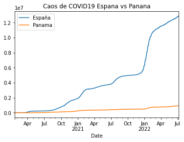
    


# Ahora veremos el mismo ejercicio con los paises centroaméricanos
1. Costa Rica
2. Honduras
3. El Salvador
4. Guatemala 
5. Nicaragua


Lo haremos en orden de lista iniciando con Costa Rica. 


```python
df [df['Country']=='Costa Rica']
```


<div>
<style scoped>
    .dataframe tbody tr th:only-of-type {
        vertical-align: middle;
    }

    .dataframe tbody tr th {
        vertical-align: top;
    }

    .dataframe thead th {
        text-align: right;
    }
</style>
<table border="1" class="dataframe">
  <thead>
    <tr style="text-align: right;">
      <th></th>
      <th>Country</th>
      <th>Slug</th>
      <th>ISO2</th>
    </tr>
  </thead>
  <tbody>
    <tr>
      <th>242</th>
      <td>Costa Rica</td>
      <td>costa-rica</td>
      <td>CR</td>
    </tr>
  </tbody>
</table>
</div>


```python
url_rt_cr= 'https://api.covid19api.com/country/Costa-Rica/status/confirmed/live'
df_rt_cr= pd.read_json(url_rt_cr)
df_rt_cr
```


<div>
<style scoped>
    .dataframe tbody tr th:only-of-type {
        vertical-align: middle;
    }

    .dataframe tbody tr th {
        vertical-align: top;
    }

    .dataframe thead th {
        text-align: right;
    }
</style>
<table border="1" class="dataframe">
  <thead>
    <tr style="text-align: right;">
      <th></th>
      <th>Country</th>
      <th>CountryCode</th>
      <th>Province</th>
      <th>City</th>
      <th>CityCode</th>
      <th>Lat</th>
      <th>Lon</th>
      <th>Cases</th>
      <th>Status</th>
      <th>Date</th>
    </tr>
  </thead>
  <tbody>
    <tr>
      <th>0</th>
      <td>Costa Rica</td>
      <td>CR</td>
      <td></td>
      <td></td>
      <td></td>
      <td>9.75</td>
      <td>-83.75</td>
      <td>0</td>
      <td>confirmed</td>
      <td>2020-01-22 00:00:00+00:00</td>
    </tr>
    <tr>
      <th>1</th>
      <td>Costa Rica</td>
      <td>CR</td>
      <td></td>
      <td></td>
      <td></td>
      <td>9.75</td>
      <td>-83.75</td>
      <td>0</td>
      <td>confirmed</td>
      <td>2020-01-23 00:00:00+00:00</td>
    </tr>
    <tr>
      <th>2</th>
      <td>Costa Rica</td>
      <td>CR</td>
      <td></td>
      <td></td>
      <td></td>
      <td>9.75</td>
      <td>-83.75</td>
      <td>0</td>
      <td>confirmed</td>
      <td>2020-01-24 00:00:00+00:00</td>
    </tr>
    <tr>
      <th>3</th>
      <td>Costa Rica</td>
      <td>CR</td>
      <td></td>
      <td></td>
      <td></td>
      <td>9.75</td>
      <td>-83.75</td>
      <td>0</td>
      <td>confirmed</td>
      <td>2020-01-25 00:00:00+00:00</td>
    </tr>
    <tr>
      <th>4</th>
      <td>Costa Rica</td>
      <td>CR</td>
      <td></td>
      <td></td>
      <td></td>
      <td>9.75</td>
      <td>-83.75</td>
      <td>0</td>
      <td>confirmed</td>
      <td>2020-01-26 00:00:00+00:00</td>
    </tr>
    <tr>
      <th>...</th>
      <td>...</td>
      <td>...</td>
      <td>...</td>
      <td>...</td>
      <td>...</td>
      <td>...</td>
      <td>...</td>
      <td>...</td>
      <td>...</td>
      <td>...</td>
    </tr>
    <tr>
      <th>893</th>
      <td>Costa Rica</td>
      <td>CR</td>
      <td></td>
      <td></td>
      <td></td>
      <td>9.75</td>
      <td>-83.75</td>
      <td>904934</td>
      <td>confirmed</td>
      <td>2022-07-03 00:00:00+00:00</td>
    </tr>
    <tr>
      <th>894</th>
      <td>Costa Rica</td>
      <td>CR</td>
      <td></td>
      <td></td>
      <td></td>
      <td>9.75</td>
      <td>-83.75</td>
      <td>904934</td>
      <td>confirmed</td>
      <td>2022-07-04 00:00:00+00:00</td>
    </tr>
    <tr>
      <th>895</th>
      <td>Costa Rica</td>
      <td>CR</td>
      <td></td>
      <td></td>
      <td></td>
      <td>9.75</td>
      <td>-83.75</td>
      <td>904934</td>
      <td>confirmed</td>
      <td>2022-07-05 00:00:00+00:00</td>
    </tr>
    <tr>
      <th>896</th>
      <td>Costa Rica</td>
      <td>CR</td>
      <td></td>
      <td></td>
      <td></td>
      <td>9.75</td>
      <td>-83.75</td>
      <td>904934</td>
      <td>confirmed</td>
      <td>2022-07-06 00:00:00+00:00</td>
    </tr>
    <tr>
      <th>897</th>
      <td>Costa Rica</td>
      <td>CR</td>
      <td></td>
      <td></td>
      <td></td>
      <td>9.75</td>
      <td>-83.75</td>
      <td>904934</td>
      <td>confirmed</td>
      <td>2022-07-07 00:00:00+00:00</td>
    </tr>
  </tbody>
</table>
<p>898 rows × 10 columns</p>
</div>


```python
casos_cr= df_rt_cr.set_index('Date')['Cases']
casos_cr.plot(title="Casos de Covid19 en Costa Rica")
```


    <AxesSubplot:title={'center':'Casos de Covid19 en Costa Rica'}, xlabel='Date'>


    

    


```python
pa_vs_cr= pd.concat([casos_cr,casos_pa],axis=1)
pa_vs_cr

```


<div>
<style scoped>
    .dataframe tbody tr th:only-of-type {
        vertical-align: middle;
    }

    .dataframe tbody tr th {
        vertical-align: top;
    }

    .dataframe thead th {
        text-align: right;
    }
</style>
<table border="1" class="dataframe">
  <thead>
    <tr style="text-align: right;">
      <th></th>
      <th>Cases</th>
      <th>Cases</th>
    </tr>
    <tr>
      <th>Date</th>
      <th></th>
      <th></th>
    </tr>
  </thead>
  <tbody>
    <tr>
      <th>2020-01-22 00:00:00+00:00</th>
      <td>0</td>
      <td>0</td>
    </tr>
    <tr>
      <th>2020-01-23 00:00:00+00:00</th>
      <td>0</td>
      <td>0</td>
    </tr>
    <tr>
      <th>2020-01-24 00:00:00+00:00</th>
      <td>0</td>
      <td>0</td>
    </tr>
    <tr>
      <th>2020-01-25 00:00:00+00:00</th>
      <td>0</td>
      <td>0</td>
    </tr>
    <tr>
      <th>2020-01-26 00:00:00+00:00</th>
      <td>0</td>
      <td>0</td>
    </tr>
    <tr>
      <th>...</th>
      <td>...</td>
      <td>...</td>
    </tr>
    <tr>
      <th>2022-07-03 00:00:00+00:00</th>
      <td>904934</td>
      <td>925254</td>
    </tr>
    <tr>
      <th>2022-07-04 00:00:00+00:00</th>
      <td>904934</td>
      <td>925254</td>
    </tr>
    <tr>
      <th>2022-07-05 00:00:00+00:00</th>
      <td>904934</td>
      <td>925254</td>
    </tr>
    <tr>
      <th>2022-07-06 00:00:00+00:00</th>
      <td>904934</td>
      <td>925254</td>
    </tr>
    <tr>
      <th>2022-07-07 00:00:00+00:00</th>
      <td>904934</td>
      <td>925254</td>
    </tr>
  </tbody>
</table>
<p>898 rows × 2 columns</p>
</div>


```python
pa_vs_cr.columns=['Costa Rica', 'Panama']
pa_vs_cr
```


<div>
<style scoped>
    .dataframe tbody tr th:only-of-type {
        vertical-align: middle;
    }

    .dataframe tbody tr th {
        vertical-align: top;
    }

    .dataframe thead th {
        text-align: right;
    }
</style>
<table border="1" class="dataframe">
  <thead>
    <tr style="text-align: right;">
      <th></th>
      <th>Costa Rica</th>
      <th>Panama</th>
    </tr>
    <tr>
      <th>Date</th>
      <th></th>
      <th></th>
    </tr>
  </thead>
  <tbody>
    <tr>
      <th>2020-01-22 00:00:00+00:00</th>
      <td>0</td>
      <td>0</td>
    </tr>
    <tr>
      <th>2020-01-23 00:00:00+00:00</th>
      <td>0</td>
      <td>0</td>
    </tr>
    <tr>
      <th>2020-01-24 00:00:00+00:00</th>
      <td>0</td>
      <td>0</td>
    </tr>
    <tr>
      <th>2020-01-25 00:00:00+00:00</th>
      <td>0</td>
      <td>0</td>
    </tr>
    <tr>
      <th>2020-01-26 00:00:00+00:00</th>
      <td>0</td>
      <td>0</td>
    </tr>
    <tr>
      <th>...</th>
      <td>...</td>
      <td>...</td>
    </tr>
    <tr>
      <th>2022-07-03 00:00:00+00:00</th>
      <td>904934</td>
      <td>925254</td>
    </tr>
    <tr>
      <th>2022-07-04 00:00:00+00:00</th>
      <td>904934</td>
      <td>925254</td>
    </tr>
    <tr>
      <th>2022-07-05 00:00:00+00:00</th>
      <td>904934</td>
      <td>925254</td>
    </tr>
    <tr>
      <th>2022-07-06 00:00:00+00:00</th>
      <td>904934</td>
      <td>925254</td>
    </tr>
    <tr>
      <th>2022-07-07 00:00:00+00:00</th>
      <td>904934</td>
      <td>925254</td>
    </tr>
  </tbody>
</table>
<p>898 rows × 2 columns</p>
</div>


## Hacemos la comparativa entre Costa Rica y Panamá


```python
pa_vs_cr.plot(title= "Caos de COVID19 Costa Rica vs Panana")
```


    <AxesSubplot:title={'center':'Caos de COVID19 Costa Rica vs Panana'}, xlabel='Date'>


    
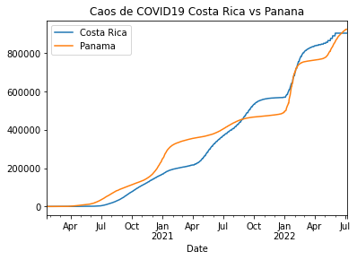
    


### Siguiendo en el orden es el turono de Honduras


```python
df [df['Country']=='Honduras']
```


<div>
<style scoped>
    .dataframe tbody tr th:only-of-type {
        vertical-align: middle;
    }

    .dataframe tbody tr th {
        vertical-align: top;
    }

    .dataframe thead th {
        text-align: right;
    }
</style>
<table border="1" class="dataframe">
  <thead>
    <tr style="text-align: right;">
      <th></th>
      <th>Country</th>
      <th>Slug</th>
      <th>ISO2</th>
    </tr>
  </thead>
  <tbody>
    <tr>
      <th>91</th>
      <td>Honduras</td>
      <td>honduras</td>
      <td>HN</td>
    </tr>
  </tbody>
</table>
</div>


```python
url_rt_hn= 'https://api.covid19api.com/country/Honduras/status/confirmed/live'
df_rt_hn= pd.read_json(url_rt_hn)
df_rt_hn
```


<div>
<style scoped>
    .dataframe tbody tr th:only-of-type {
        vertical-align: middle;
    }

    .dataframe tbody tr th {
        vertical-align: top;
    }

    .dataframe thead th {
        text-align: right;
    }
</style>
<table border="1" class="dataframe">
  <thead>
    <tr style="text-align: right;">
      <th></th>
      <th>Country</th>
      <th>CountryCode</th>
      <th>Province</th>
      <th>City</th>
      <th>CityCode</th>
      <th>Lat</th>
      <th>Lon</th>
      <th>Cases</th>
      <th>Status</th>
      <th>Date</th>
    </tr>
  </thead>
  <tbody>
    <tr>
      <th>0</th>
      <td>Honduras</td>
      <td>HN</td>
      <td></td>
      <td></td>
      <td></td>
      <td>15.2</td>
      <td>-86.24</td>
      <td>0</td>
      <td>confirmed</td>
      <td>2020-01-22 00:00:00+00:00</td>
    </tr>
    <tr>
      <th>1</th>
      <td>Honduras</td>
      <td>HN</td>
      <td></td>
      <td></td>
      <td></td>
      <td>15.2</td>
      <td>-86.24</td>
      <td>0</td>
      <td>confirmed</td>
      <td>2020-01-23 00:00:00+00:00</td>
    </tr>
    <tr>
      <th>2</th>
      <td>Honduras</td>
      <td>HN</td>
      <td></td>
      <td></td>
      <td></td>
      <td>15.2</td>
      <td>-86.24</td>
      <td>0</td>
      <td>confirmed</td>
      <td>2020-01-24 00:00:00+00:00</td>
    </tr>
    <tr>
      <th>3</th>
      <td>Honduras</td>
      <td>HN</td>
      <td></td>
      <td></td>
      <td></td>
      <td>15.2</td>
      <td>-86.24</td>
      <td>0</td>
      <td>confirmed</td>
      <td>2020-01-25 00:00:00+00:00</td>
    </tr>
    <tr>
      <th>4</th>
      <td>Honduras</td>
      <td>HN</td>
      <td></td>
      <td></td>
      <td></td>
      <td>15.2</td>
      <td>-86.24</td>
      <td>0</td>
      <td>confirmed</td>
      <td>2020-01-26 00:00:00+00:00</td>
    </tr>
    <tr>
      <th>...</th>
      <td>...</td>
      <td>...</td>
      <td>...</td>
      <td>...</td>
      <td>...</td>
      <td>...</td>
      <td>...</td>
      <td>...</td>
      <td>...</td>
      <td>...</td>
    </tr>
    <tr>
      <th>893</th>
      <td>Honduras</td>
      <td>HN</td>
      <td></td>
      <td></td>
      <td></td>
      <td>15.2</td>
      <td>-86.24</td>
      <td>427718</td>
      <td>confirmed</td>
      <td>2022-07-03 00:00:00+00:00</td>
    </tr>
    <tr>
      <th>894</th>
      <td>Honduras</td>
      <td>HN</td>
      <td></td>
      <td></td>
      <td></td>
      <td>15.2</td>
      <td>-86.24</td>
      <td>427718</td>
      <td>confirmed</td>
      <td>2022-07-04 00:00:00+00:00</td>
    </tr>
    <tr>
      <th>895</th>
      <td>Honduras</td>
      <td>HN</td>
      <td></td>
      <td></td>
      <td></td>
      <td>15.2</td>
      <td>-86.24</td>
      <td>427718</td>
      <td>confirmed</td>
      <td>2022-07-05 00:00:00+00:00</td>
    </tr>
    <tr>
      <th>896</th>
      <td>Honduras</td>
      <td>HN</td>
      <td></td>
      <td></td>
      <td></td>
      <td>15.2</td>
      <td>-86.24</td>
      <td>427718</td>
      <td>confirmed</td>
      <td>2022-07-06 00:00:00+00:00</td>
    </tr>
    <tr>
      <th>897</th>
      <td>Honduras</td>
      <td>HN</td>
      <td></td>
      <td></td>
      <td></td>
      <td>15.2</td>
      <td>-86.24</td>
      <td>427718</td>
      <td>confirmed</td>
      <td>2022-07-07 00:00:00+00:00</td>
    </tr>
  </tbody>
</table>
<p>898 rows × 10 columns</p>
</div>


```python
casos_hn= df_rt_hn.set_index('Date')['Cases']
casos_hn.plot(title="Casos de Covid19 en Honduras")
```


    <AxesSubplot:title={'center':'Casos de Covid19 en Honduras'}, xlabel='Date'>


    
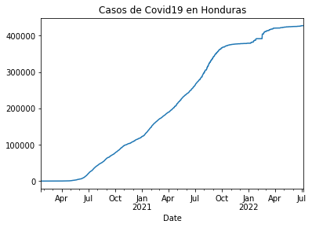
    


```python

```


```python
pa_vs_hn= pd.concat([casos_hn,casos_pa],axis=1)
pa_vs_hn
```


<div>
<style scoped>
    .dataframe tbody tr th:only-of-type {
        vertical-align: middle;
    }

    .dataframe tbody tr th {
        vertical-align: top;
    }

    .dataframe thead th {
        text-align: right;
    }
</style>
<table border="1" class="dataframe">
  <thead>
    <tr style="text-align: right;">
      <th></th>
      <th>Cases</th>
      <th>Cases</th>
    </tr>
    <tr>
      <th>Date</th>
      <th></th>
      <th></th>
    </tr>
  </thead>
  <tbody>
    <tr>
      <th>2020-01-22 00:00:00+00:00</th>
      <td>0</td>
      <td>0</td>
    </tr>
    <tr>
      <th>2020-01-23 00:00:00+00:00</th>
      <td>0</td>
      <td>0</td>
    </tr>
    <tr>
      <th>2020-01-24 00:00:00+00:00</th>
      <td>0</td>
      <td>0</td>
    </tr>
    <tr>
      <th>2020-01-25 00:00:00+00:00</th>
      <td>0</td>
      <td>0</td>
    </tr>
    <tr>
      <th>2020-01-26 00:00:00+00:00</th>
      <td>0</td>
      <td>0</td>
    </tr>
    <tr>
      <th>...</th>
      <td>...</td>
      <td>...</td>
    </tr>
    <tr>
      <th>2022-07-03 00:00:00+00:00</th>
      <td>427718</td>
      <td>925254</td>
    </tr>
    <tr>
      <th>2022-07-04 00:00:00+00:00</th>
      <td>427718</td>
      <td>925254</td>
    </tr>
    <tr>
      <th>2022-07-05 00:00:00+00:00</th>
      <td>427718</td>
      <td>925254</td>
    </tr>
    <tr>
      <th>2022-07-06 00:00:00+00:00</th>
      <td>427718</td>
      <td>925254</td>
    </tr>
    <tr>
      <th>2022-07-07 00:00:00+00:00</th>
      <td>427718</td>
      <td>925254</td>
    </tr>
  </tbody>
</table>
<p>898 rows × 2 columns</p>
</div>


```python
pa_vs_hn.columns=['Honduras', 'Panama']
pa_vs_hn
```


<div>
<style scoped>
    .dataframe tbody tr th:only-of-type {
        vertical-align: middle;
    }

    .dataframe tbody tr th {
        vertical-align: top;
    }

    .dataframe thead th {
        text-align: right;
    }
</style>
<table border="1" class="dataframe">
  <thead>
    <tr style="text-align: right;">
      <th></th>
      <th>Honduras</th>
      <th>Panama</th>
    </tr>
    <tr>
      <th>Date</th>
      <th></th>
      <th></th>
    </tr>
  </thead>
  <tbody>
    <tr>
      <th>2020-01-22 00:00:00+00:00</th>
      <td>0</td>
      <td>0</td>
    </tr>
    <tr>
      <th>2020-01-23 00:00:00+00:00</th>
      <td>0</td>
      <td>0</td>
    </tr>
    <tr>
      <th>2020-01-24 00:00:00+00:00</th>
      <td>0</td>
      <td>0</td>
    </tr>
    <tr>
      <th>2020-01-25 00:00:00+00:00</th>
      <td>0</td>
      <td>0</td>
    </tr>
    <tr>
      <th>2020-01-26 00:00:00+00:00</th>
      <td>0</td>
      <td>0</td>
    </tr>
    <tr>
      <th>...</th>
      <td>...</td>
      <td>...</td>
    </tr>
    <tr>
      <th>2022-07-03 00:00:00+00:00</th>
      <td>427718</td>
      <td>925254</td>
    </tr>
    <tr>
      <th>2022-07-04 00:00:00+00:00</th>
      <td>427718</td>
      <td>925254</td>
    </tr>
    <tr>
      <th>2022-07-05 00:00:00+00:00</th>
      <td>427718</td>
      <td>925254</td>
    </tr>
    <tr>
      <th>2022-07-06 00:00:00+00:00</th>
      <td>427718</td>
      <td>925254</td>
    </tr>
    <tr>
      <th>2022-07-07 00:00:00+00:00</th>
      <td>427718</td>
      <td>925254</td>
    </tr>
  </tbody>
</table>
<p>898 rows × 2 columns</p>
</div>


## Hacemos la comparativa entre Honduras y Panamá


```python
pa_vs_hn.plot(title= "Caos de COVID19 Honduras vs Panana")
```


    <AxesSubplot:title={'center':'Caos de COVID19 Honduras vs Panana'}, xlabel='Date'>


    
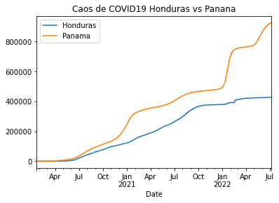
    


### En el siguiente ejercicio ejecutaremos los datos de El Salvador


```python
df [df['Country']=='El Salvador']
```


<div>
<style scoped>
    .dataframe tbody tr th:only-of-type {
        vertical-align: middle;
    }

    .dataframe tbody tr th {
        vertical-align: top;
    }

    .dataframe thead th {
        text-align: right;
    }
</style>
<table border="1" class="dataframe">
  <thead>
    <tr style="text-align: right;">
      <th></th>
      <th>Country</th>
      <th>Slug</th>
      <th>ISO2</th>
    </tr>
  </thead>
  <tbody>
    <tr>
      <th>139</th>
      <td>El Salvador</td>
      <td>el-salvador</td>
      <td>SV</td>
    </tr>
  </tbody>
</table>
</div>


```python
url_rt_sv= 'https://api.covid19api.com/country/El-Salvador/status/confirmed/live'
df_rt_sv= pd.read_json(url_rt_sv)
df_rt_sv
```


<div>
<style scoped>
    .dataframe tbody tr th:only-of-type {
        vertical-align: middle;
    }

    .dataframe tbody tr th {
        vertical-align: top;
    }

    .dataframe thead th {
        text-align: right;
    }
</style>
<table border="1" class="dataframe">
  <thead>
    <tr style="text-align: right;">
      <th></th>
      <th>Country</th>
      <th>CountryCode</th>
      <th>Province</th>
      <th>City</th>
      <th>CityCode</th>
      <th>Lat</th>
      <th>Lon</th>
      <th>Cases</th>
      <th>Status</th>
      <th>Date</th>
    </tr>
  </thead>
  <tbody>
    <tr>
      <th>0</th>
      <td>El Salvador</td>
      <td>SV</td>
      <td></td>
      <td></td>
      <td></td>
      <td>13.79</td>
      <td>-88.9</td>
      <td>0</td>
      <td>confirmed</td>
      <td>2020-01-22 00:00:00+00:00</td>
    </tr>
    <tr>
      <th>1</th>
      <td>El Salvador</td>
      <td>SV</td>
      <td></td>
      <td></td>
      <td></td>
      <td>13.79</td>
      <td>-88.9</td>
      <td>0</td>
      <td>confirmed</td>
      <td>2020-01-23 00:00:00+00:00</td>
    </tr>
    <tr>
      <th>2</th>
      <td>El Salvador</td>
      <td>SV</td>
      <td></td>
      <td></td>
      <td></td>
      <td>13.79</td>
      <td>-88.9</td>
      <td>0</td>
      <td>confirmed</td>
      <td>2020-01-24 00:00:00+00:00</td>
    </tr>
    <tr>
      <th>3</th>
      <td>El Salvador</td>
      <td>SV</td>
      <td></td>
      <td></td>
      <td></td>
      <td>13.79</td>
      <td>-88.9</td>
      <td>0</td>
      <td>confirmed</td>
      <td>2020-01-25 00:00:00+00:00</td>
    </tr>
    <tr>
      <th>4</th>
      <td>El Salvador</td>
      <td>SV</td>
      <td></td>
      <td></td>
      <td></td>
      <td>13.79</td>
      <td>-88.9</td>
      <td>0</td>
      <td>confirmed</td>
      <td>2020-01-26 00:00:00+00:00</td>
    </tr>
    <tr>
      <th>...</th>
      <td>...</td>
      <td>...</td>
      <td>...</td>
      <td>...</td>
      <td>...</td>
      <td>...</td>
      <td>...</td>
      <td>...</td>
      <td>...</td>
      <td>...</td>
    </tr>
    <tr>
      <th>893</th>
      <td>El Salvador</td>
      <td>SV</td>
      <td></td>
      <td></td>
      <td></td>
      <td>13.79</td>
      <td>-88.9</td>
      <td>169646</td>
      <td>confirmed</td>
      <td>2022-07-03 00:00:00+00:00</td>
    </tr>
    <tr>
      <th>894</th>
      <td>El Salvador</td>
      <td>SV</td>
      <td></td>
      <td></td>
      <td></td>
      <td>13.79</td>
      <td>-88.9</td>
      <td>169646</td>
      <td>confirmed</td>
      <td>2022-07-04 00:00:00+00:00</td>
    </tr>
    <tr>
      <th>895</th>
      <td>El Salvador</td>
      <td>SV</td>
      <td></td>
      <td></td>
      <td></td>
      <td>13.79</td>
      <td>-88.9</td>
      <td>169646</td>
      <td>confirmed</td>
      <td>2022-07-05 00:00:00+00:00</td>
    </tr>
    <tr>
      <th>896</th>
      <td>El Salvador</td>
      <td>SV</td>
      <td></td>
      <td></td>
      <td></td>
      <td>13.79</td>
      <td>-88.9</td>
      <td>169646</td>
      <td>confirmed</td>
      <td>2022-07-06 00:00:00+00:00</td>
    </tr>
    <tr>
      <th>897</th>
      <td>El Salvador</td>
      <td>SV</td>
      <td></td>
      <td></td>
      <td></td>
      <td>13.79</td>
      <td>-88.9</td>
      <td>169646</td>
      <td>confirmed</td>
      <td>2022-07-07 00:00:00+00:00</td>
    </tr>
  </tbody>
</table>
<p>898 rows × 10 columns</p>
</div>


```python
casos_sv= df_rt_sv.set_index('Date')['Cases']
casos_sv.plot(title="Casos de Covid19 en El Salvador")
```


    <AxesSubplot:title={'center':'Casos de Covid19 en El Salvador'}, xlabel='Date'>


    

    


```python
pa_vs_sv= pd.concat([casos_sv,casos_pa],axis=1)
pa_vs_sv
```


<div>
<style scoped>
    .dataframe tbody tr th:only-of-type {
        vertical-align: middle;
    }

    .dataframe tbody tr th {
        vertical-align: top;
    }

    .dataframe thead th {
        text-align: right;
    }
</style>
<table border="1" class="dataframe">
  <thead>
    <tr style="text-align: right;">
      <th></th>
      <th>Cases</th>
      <th>Cases</th>
    </tr>
    <tr>
      <th>Date</th>
      <th></th>
      <th></th>
    </tr>
  </thead>
  <tbody>
    <tr>
      <th>2020-01-22 00:00:00+00:00</th>
      <td>0</td>
      <td>0</td>
    </tr>
    <tr>
      <th>2020-01-23 00:00:00+00:00</th>
      <td>0</td>
      <td>0</td>
    </tr>
    <tr>
      <th>2020-01-24 00:00:00+00:00</th>
      <td>0</td>
      <td>0</td>
    </tr>
    <tr>
      <th>2020-01-25 00:00:00+00:00</th>
      <td>0</td>
      <td>0</td>
    </tr>
    <tr>
      <th>2020-01-26 00:00:00+00:00</th>
      <td>0</td>
      <td>0</td>
    </tr>
    <tr>
      <th>...</th>
      <td>...</td>
      <td>...</td>
    </tr>
    <tr>
      <th>2022-07-03 00:00:00+00:00</th>
      <td>169646</td>
      <td>925254</td>
    </tr>
    <tr>
      <th>2022-07-04 00:00:00+00:00</th>
      <td>169646</td>
      <td>925254</td>
    </tr>
    <tr>
      <th>2022-07-05 00:00:00+00:00</th>
      <td>169646</td>
      <td>925254</td>
    </tr>
    <tr>
      <th>2022-07-06 00:00:00+00:00</th>
      <td>169646</td>
      <td>925254</td>
    </tr>
    <tr>
      <th>2022-07-07 00:00:00+00:00</th>
      <td>169646</td>
      <td>925254</td>
    </tr>
  </tbody>
</table>
<p>898 rows × 2 columns</p>
</div>


```python
pa_vs_sv.columns=['El Salvador', 'Panama']
pa_vs_sv
```


<div>
<style scoped>
    .dataframe tbody tr th:only-of-type {
        vertical-align: middle;
    }

    .dataframe tbody tr th {
        vertical-align: top;
    }

    .dataframe thead th {
        text-align: right;
    }
</style>
<table border="1" class="dataframe">
  <thead>
    <tr style="text-align: right;">
      <th></th>
      <th>El Salvador</th>
      <th>Panama</th>
    </tr>
    <tr>
      <th>Date</th>
      <th></th>
      <th></th>
    </tr>
  </thead>
  <tbody>
    <tr>
      <th>2020-01-22 00:00:00+00:00</th>
      <td>0</td>
      <td>0</td>
    </tr>
    <tr>
      <th>2020-01-23 00:00:00+00:00</th>
      <td>0</td>
      <td>0</td>
    </tr>
    <tr>
      <th>2020-01-24 00:00:00+00:00</th>
      <td>0</td>
      <td>0</td>
    </tr>
    <tr>
      <th>2020-01-25 00:00:00+00:00</th>
      <td>0</td>
      <td>0</td>
    </tr>
    <tr>
      <th>2020-01-26 00:00:00+00:00</th>
      <td>0</td>
      <td>0</td>
    </tr>
    <tr>
      <th>...</th>
      <td>...</td>
      <td>...</td>
    </tr>
    <tr>
      <th>2022-07-03 00:00:00+00:00</th>
      <td>169646</td>
      <td>925254</td>
    </tr>
    <tr>
      <th>2022-07-04 00:00:00+00:00</th>
      <td>169646</td>
      <td>925254</td>
    </tr>
    <tr>
      <th>2022-07-05 00:00:00+00:00</th>
      <td>169646</td>
      <td>925254</td>
    </tr>
    <tr>
      <th>2022-07-06 00:00:00+00:00</th>
      <td>169646</td>
      <td>925254</td>
    </tr>
    <tr>
      <th>2022-07-07 00:00:00+00:00</th>
      <td>169646</td>
      <td>925254</td>
    </tr>
  </tbody>
</table>
<p>898 rows × 2 columns</p>
</div>


## Hacemos la comparativa entre El Salvador y Panamá


```python
pa_vs_sv.plot(title= "Caos de COVID19 El Salvador vs Panana")
```


    <AxesSubplot:title={'center':'Caos de COVID19 El Salvador vs Panana'}, xlabel='Date'>


    
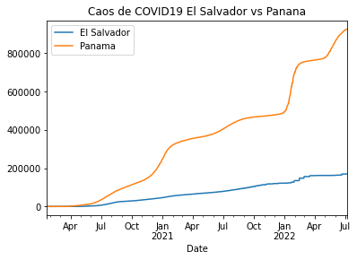
    


### Continuamos con Guatemala


```python
df [df['Country']=='Guatemala']
```


<div>
<style scoped>
    .dataframe tbody tr th:only-of-type {
        vertical-align: middle;
    }

    .dataframe tbody tr th {
        vertical-align: top;
    }

    .dataframe thead th {
        text-align: right;
    }
</style>
<table border="1" class="dataframe">
  <thead>
    <tr style="text-align: right;">
      <th></th>
      <th>Country</th>
      <th>Slug</th>
      <th>ISO2</th>
    </tr>
  </thead>
  <tbody>
    <tr>
      <th>239</th>
      <td>Guatemala</td>
      <td>guatemala</td>
      <td>GT</td>
    </tr>
  </tbody>
</table>
</div>


```python
url_rt_gt= 'https://api.covid19api.com/country/Guatemala/status/confirmed/live'
df_rt_gt= pd.read_json(url_rt_gt)
df_rt_gt
```


<div>
<style scoped>
    .dataframe tbody tr th:only-of-type {
        vertical-align: middle;
    }

    .dataframe tbody tr th {
        vertical-align: top;
    }

    .dataframe thead th {
        text-align: right;
    }
</style>
<table border="1" class="dataframe">
  <thead>
    <tr style="text-align: right;">
      <th></th>
      <th>Country</th>
      <th>CountryCode</th>
      <th>Province</th>
      <th>City</th>
      <th>CityCode</th>
      <th>Lat</th>
      <th>Lon</th>
      <th>Cases</th>
      <th>Status</th>
      <th>Date</th>
    </tr>
  </thead>
  <tbody>
    <tr>
      <th>0</th>
      <td>Guatemala</td>
      <td>GT</td>
      <td></td>
      <td></td>
      <td></td>
      <td>15.78</td>
      <td>-90.23</td>
      <td>0</td>
      <td>confirmed</td>
      <td>2020-01-22 00:00:00+00:00</td>
    </tr>
    <tr>
      <th>1</th>
      <td>Guatemala</td>
      <td>GT</td>
      <td></td>
      <td></td>
      <td></td>
      <td>15.78</td>
      <td>-90.23</td>
      <td>0</td>
      <td>confirmed</td>
      <td>2020-01-23 00:00:00+00:00</td>
    </tr>
    <tr>
      <th>2</th>
      <td>Guatemala</td>
      <td>GT</td>
      <td></td>
      <td></td>
      <td></td>
      <td>15.78</td>
      <td>-90.23</td>
      <td>0</td>
      <td>confirmed</td>
      <td>2020-01-24 00:00:00+00:00</td>
    </tr>
    <tr>
      <th>3</th>
      <td>Guatemala</td>
      <td>GT</td>
      <td></td>
      <td></td>
      <td></td>
      <td>15.78</td>
      <td>-90.23</td>
      <td>0</td>
      <td>confirmed</td>
      <td>2020-01-25 00:00:00+00:00</td>
    </tr>
    <tr>
      <th>4</th>
      <td>Guatemala</td>
      <td>GT</td>
      <td></td>
      <td></td>
      <td></td>
      <td>15.78</td>
      <td>-90.23</td>
      <td>0</td>
      <td>confirmed</td>
      <td>2020-01-26 00:00:00+00:00</td>
    </tr>
    <tr>
      <th>...</th>
      <td>...</td>
      <td>...</td>
      <td>...</td>
      <td>...</td>
      <td>...</td>
      <td>...</td>
      <td>...</td>
      <td>...</td>
      <td>...</td>
      <td>...</td>
    </tr>
    <tr>
      <th>893</th>
      <td>Guatemala</td>
      <td>GT</td>
      <td></td>
      <td></td>
      <td></td>
      <td>15.78</td>
      <td>-90.23</td>
      <td>920294</td>
      <td>confirmed</td>
      <td>2022-07-03 00:00:00+00:00</td>
    </tr>
    <tr>
      <th>894</th>
      <td>Guatemala</td>
      <td>GT</td>
      <td></td>
      <td></td>
      <td></td>
      <td>15.78</td>
      <td>-90.23</td>
      <td>921146</td>
      <td>confirmed</td>
      <td>2022-07-04 00:00:00+00:00</td>
    </tr>
    <tr>
      <th>895</th>
      <td>Guatemala</td>
      <td>GT</td>
      <td></td>
      <td></td>
      <td></td>
      <td>15.78</td>
      <td>-90.23</td>
      <td>922340</td>
      <td>confirmed</td>
      <td>2022-07-05 00:00:00+00:00</td>
    </tr>
    <tr>
      <th>896</th>
      <td>Guatemala</td>
      <td>GT</td>
      <td></td>
      <td></td>
      <td></td>
      <td>15.78</td>
      <td>-90.23</td>
      <td>927473</td>
      <td>confirmed</td>
      <td>2022-07-06 00:00:00+00:00</td>
    </tr>
    <tr>
      <th>897</th>
      <td>Guatemala</td>
      <td>GT</td>
      <td></td>
      <td></td>
      <td></td>
      <td>15.78</td>
      <td>-90.23</td>
      <td>927473</td>
      <td>confirmed</td>
      <td>2022-07-07 00:00:00+00:00</td>
    </tr>
  </tbody>
</table>
<p>898 rows × 10 columns</p>
</div>


```python
casos_gt= df_rt_gt.set_index('Date')['Cases']
casos_gt.plot(title="Casos de Covid19 en Guatemala")
```


    <AxesSubplot:title={'center':'Casos de Covid19 en Guatemala'}, xlabel='Date'>


    
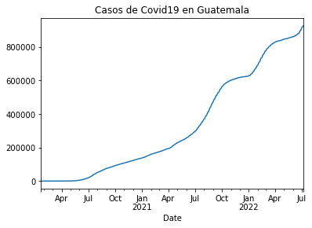
    


```python
pa_vs_gt= pd.concat([casos_gt,casos_pa],axis=1)
pa_vs_gt
```


<div>
<style scoped>
    .dataframe tbody tr th:only-of-type {
        vertical-align: middle;
    }

    .dataframe tbody tr th {
        vertical-align: top;
    }

    .dataframe thead th {
        text-align: right;
    }
</style>
<table border="1" class="dataframe">
  <thead>
    <tr style="text-align: right;">
      <th></th>
      <th>Cases</th>
      <th>Cases</th>
    </tr>
    <tr>
      <th>Date</th>
      <th></th>
      <th></th>
    </tr>
  </thead>
  <tbody>
    <tr>
      <th>2020-01-22 00:00:00+00:00</th>
      <td>0</td>
      <td>0</td>
    </tr>
    <tr>
      <th>2020-01-23 00:00:00+00:00</th>
      <td>0</td>
      <td>0</td>
    </tr>
    <tr>
      <th>2020-01-24 00:00:00+00:00</th>
      <td>0</td>
      <td>0</td>
    </tr>
    <tr>
      <th>2020-01-25 00:00:00+00:00</th>
      <td>0</td>
      <td>0</td>
    </tr>
    <tr>
      <th>2020-01-26 00:00:00+00:00</th>
      <td>0</td>
      <td>0</td>
    </tr>
    <tr>
      <th>...</th>
      <td>...</td>
      <td>...</td>
    </tr>
    <tr>
      <th>2022-07-03 00:00:00+00:00</th>
      <td>920294</td>
      <td>925254</td>
    </tr>
    <tr>
      <th>2022-07-04 00:00:00+00:00</th>
      <td>921146</td>
      <td>925254</td>
    </tr>
    <tr>
      <th>2022-07-05 00:00:00+00:00</th>
      <td>922340</td>
      <td>925254</td>
    </tr>
    <tr>
      <th>2022-07-06 00:00:00+00:00</th>
      <td>927473</td>
      <td>925254</td>
    </tr>
    <tr>
      <th>2022-07-07 00:00:00+00:00</th>
      <td>927473</td>
      <td>925254</td>
    </tr>
  </tbody>
</table>
<p>898 rows × 2 columns</p>
</div>


```python
pa_vs_gt.columns=['Guatemala', 'Panama']
pa_vs_gt
```


<div>
<style scoped>
    .dataframe tbody tr th:only-of-type {
        vertical-align: middle;
    }

    .dataframe tbody tr th {
        vertical-align: top;
    }

    .dataframe thead th {
        text-align: right;
    }
</style>
<table border="1" class="dataframe">
  <thead>
    <tr style="text-align: right;">
      <th></th>
      <th>Guatemala</th>
      <th>Panama</th>
    </tr>
    <tr>
      <th>Date</th>
      <th></th>
      <th></th>
    </tr>
  </thead>
  <tbody>
    <tr>
      <th>2020-01-22 00:00:00+00:00</th>
      <td>0</td>
      <td>0</td>
    </tr>
    <tr>
      <th>2020-01-23 00:00:00+00:00</th>
      <td>0</td>
      <td>0</td>
    </tr>
    <tr>
      <th>2020-01-24 00:00:00+00:00</th>
      <td>0</td>
      <td>0</td>
    </tr>
    <tr>
      <th>2020-01-25 00:00:00+00:00</th>
      <td>0</td>
      <td>0</td>
    </tr>
    <tr>
      <th>2020-01-26 00:00:00+00:00</th>
      <td>0</td>
      <td>0</td>
    </tr>
    <tr>
      <th>...</th>
      <td>...</td>
      <td>...</td>
    </tr>
    <tr>
      <th>2022-07-03 00:00:00+00:00</th>
      <td>920294</td>
      <td>925254</td>
    </tr>
    <tr>
      <th>2022-07-04 00:00:00+00:00</th>
      <td>921146</td>
      <td>925254</td>
    </tr>
    <tr>
      <th>2022-07-05 00:00:00+00:00</th>
      <td>922340</td>
      <td>925254</td>
    </tr>
    <tr>
      <th>2022-07-06 00:00:00+00:00</th>
      <td>927473</td>
      <td>925254</td>
    </tr>
    <tr>
      <th>2022-07-07 00:00:00+00:00</th>
      <td>927473</td>
      <td>925254</td>
    </tr>
  </tbody>
</table>
<p>898 rows × 2 columns</p>
</div>


## Hacemos la comparativa entre Guatemala y Panamá


```python
pa_vs_gt.plot(title= "Caos de COVID19 Guatemala vs Panana")
```


    <AxesSubplot:title={'center':'Caos de COVID19 Guatemala vs Panana'}, xlabel='Date'>


    
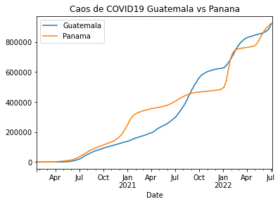
    


## Veamos ahora los datos de Nicaragua 


```python
df [df['Country']=='Nicaragua']
```


<div>
<style scoped>
    .dataframe tbody tr th:only-of-type {
        vertical-align: middle;
    }

    .dataframe tbody tr th {
        vertical-align: top;
    }

    .dataframe thead th {
        text-align: right;
    }
</style>
<table border="1" class="dataframe">
  <thead>
    <tr style="text-align: right;">
      <th></th>
      <th>Country</th>
      <th>Slug</th>
      <th>ISO2</th>
    </tr>
  </thead>
  <tbody>
    <tr>
      <th>36</th>
      <td>Nicaragua</td>
      <td>nicaragua</td>
      <td>NI</td>
    </tr>
  </tbody>
</table>
</div>


```python
url_rt_ni= 'https://api.covid19api.com/country/Nicaragua/status/confirmed/live'
df_rt_ni= pd.read_json(url_rt_ni)
df_rt_ni
```


<div>
<style scoped>
    .dataframe tbody tr th:only-of-type {
        vertical-align: middle;
    }

    .dataframe tbody tr th {
        vertical-align: top;
    }

    .dataframe thead th {
        text-align: right;
    }
</style>
<table border="1" class="dataframe">
  <thead>
    <tr style="text-align: right;">
      <th></th>
      <th>Country</th>
      <th>CountryCode</th>
      <th>Province</th>
      <th>City</th>
      <th>CityCode</th>
      <th>Lat</th>
      <th>Lon</th>
      <th>Cases</th>
      <th>Status</th>
      <th>Date</th>
    </tr>
  </thead>
  <tbody>
    <tr>
      <th>0</th>
      <td>Nicaragua</td>
      <td>NI</td>
      <td></td>
      <td></td>
      <td></td>
      <td>12.87</td>
      <td>-85.21</td>
      <td>0</td>
      <td>confirmed</td>
      <td>2020-01-22 00:00:00+00:00</td>
    </tr>
    <tr>
      <th>1</th>
      <td>Nicaragua</td>
      <td>NI</td>
      <td></td>
      <td></td>
      <td></td>
      <td>12.87</td>
      <td>-85.21</td>
      <td>0</td>
      <td>confirmed</td>
      <td>2020-01-23 00:00:00+00:00</td>
    </tr>
    <tr>
      <th>2</th>
      <td>Nicaragua</td>
      <td>NI</td>
      <td></td>
      <td></td>
      <td></td>
      <td>12.87</td>
      <td>-85.21</td>
      <td>0</td>
      <td>confirmed</td>
      <td>2020-01-24 00:00:00+00:00</td>
    </tr>
    <tr>
      <th>3</th>
      <td>Nicaragua</td>
      <td>NI</td>
      <td></td>
      <td></td>
      <td></td>
      <td>12.87</td>
      <td>-85.21</td>
      <td>0</td>
      <td>confirmed</td>
      <td>2020-01-25 00:00:00+00:00</td>
    </tr>
    <tr>
      <th>4</th>
      <td>Nicaragua</td>
      <td>NI</td>
      <td></td>
      <td></td>
      <td></td>
      <td>12.87</td>
      <td>-85.21</td>
      <td>0</td>
      <td>confirmed</td>
      <td>2020-01-26 00:00:00+00:00</td>
    </tr>
    <tr>
      <th>...</th>
      <td>...</td>
      <td>...</td>
      <td>...</td>
      <td>...</td>
      <td>...</td>
      <td>...</td>
      <td>...</td>
      <td>...</td>
      <td>...</td>
      <td>...</td>
    </tr>
    <tr>
      <th>893</th>
      <td>Nicaragua</td>
      <td>NI</td>
      <td></td>
      <td></td>
      <td></td>
      <td>12.87</td>
      <td>-85.21</td>
      <td>14690</td>
      <td>confirmed</td>
      <td>2022-07-03 00:00:00+00:00</td>
    </tr>
    <tr>
      <th>894</th>
      <td>Nicaragua</td>
      <td>NI</td>
      <td></td>
      <td></td>
      <td></td>
      <td>12.87</td>
      <td>-85.21</td>
      <td>14690</td>
      <td>confirmed</td>
      <td>2022-07-04 00:00:00+00:00</td>
    </tr>
    <tr>
      <th>895</th>
      <td>Nicaragua</td>
      <td>NI</td>
      <td></td>
      <td></td>
      <td></td>
      <td>12.87</td>
      <td>-85.21</td>
      <td>14690</td>
      <td>confirmed</td>
      <td>2022-07-05 00:00:00+00:00</td>
    </tr>
    <tr>
      <th>896</th>
      <td>Nicaragua</td>
      <td>NI</td>
      <td></td>
      <td></td>
      <td></td>
      <td>12.87</td>
      <td>-85.21</td>
      <td>14721</td>
      <td>confirmed</td>
      <td>2022-07-06 00:00:00+00:00</td>
    </tr>
    <tr>
      <th>897</th>
      <td>Nicaragua</td>
      <td>NI</td>
      <td></td>
      <td></td>
      <td></td>
      <td>12.87</td>
      <td>-85.21</td>
      <td>14721</td>
      <td>confirmed</td>
      <td>2022-07-07 00:00:00+00:00</td>
    </tr>
  </tbody>
</table>
<p>898 rows × 10 columns</p>
</div>


```python
casos_ni= df_rt_gt.set_index('Date')['Cases']
casos_ni.plot(title="Casos de Covid19 en Nicaragua")
```


    <AxesSubplot:title={'center':'Casos de Covid19 en Nicaragua'}, xlabel='Date'>


    
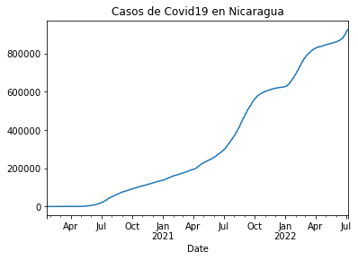
    


```python
pa_vs_ni= pd.concat([casos_ni,casos_pa],axis=1)
pa_vs_ni
```


<div>
<style scoped>
    .dataframe tbody tr th:only-of-type {
        vertical-align: middle;
    }

    .dataframe tbody tr th {
        vertical-align: top;
    }

    .dataframe thead th {
        text-align: right;
    }
</style>
<table border="1" class="dataframe">
  <thead>
    <tr style="text-align: right;">
      <th></th>
      <th>Cases</th>
      <th>Cases</th>
    </tr>
    <tr>
      <th>Date</th>
      <th></th>
      <th></th>
    </tr>
  </thead>
  <tbody>
    <tr>
      <th>2020-01-22 00:00:00+00:00</th>
      <td>0</td>
      <td>0</td>
    </tr>
    <tr>
      <th>2020-01-23 00:00:00+00:00</th>
      <td>0</td>
      <td>0</td>
    </tr>
    <tr>
      <th>2020-01-24 00:00:00+00:00</th>
      <td>0</td>
      <td>0</td>
    </tr>
    <tr>
      <th>2020-01-25 00:00:00+00:00</th>
      <td>0</td>
      <td>0</td>
    </tr>
    <tr>
      <th>2020-01-26 00:00:00+00:00</th>
      <td>0</td>
      <td>0</td>
    </tr>
    <tr>
      <th>...</th>
      <td>...</td>
      <td>...</td>
    </tr>
    <tr>
      <th>2022-07-03 00:00:00+00:00</th>
      <td>920294</td>
      <td>925254</td>
    </tr>
    <tr>
      <th>2022-07-04 00:00:00+00:00</th>
      <td>921146</td>
      <td>925254</td>
    </tr>
    <tr>
      <th>2022-07-05 00:00:00+00:00</th>
      <td>922340</td>
      <td>925254</td>
    </tr>
    <tr>
      <th>2022-07-06 00:00:00+00:00</th>
      <td>927473</td>
      <td>925254</td>
    </tr>
    <tr>
      <th>2022-07-07 00:00:00+00:00</th>
      <td>927473</td>
      <td>925254</td>
    </tr>
  </tbody>
</table>
<p>898 rows × 2 columns</p>
</div>


```python
pa_vs_ni.columns=['Nicaragua', 'Panama']
pa_vs_ni
```


<div>
<style scoped>
    .dataframe tbody tr th:only-of-type {
        vertical-align: middle;
    }

    .dataframe tbody tr th {
        vertical-align: top;
    }

    .dataframe thead th {
        text-align: right;
    }
</style>
<table border="1" class="dataframe">
  <thead>
    <tr style="text-align: right;">
      <th></th>
      <th>Nicaragua</th>
      <th>Panama</th>
    </tr>
    <tr>
      <th>Date</th>
      <th></th>
      <th></th>
    </tr>
  </thead>
  <tbody>
    <tr>
      <th>2020-01-22 00:00:00+00:00</th>
      <td>0</td>
      <td>0</td>
    </tr>
    <tr>
      <th>2020-01-23 00:00:00+00:00</th>
      <td>0</td>
      <td>0</td>
    </tr>
    <tr>
      <th>2020-01-24 00:00:00+00:00</th>
      <td>0</td>
      <td>0</td>
    </tr>
    <tr>
      <th>2020-01-25 00:00:00+00:00</th>
      <td>0</td>
      <td>0</td>
    </tr>
    <tr>
      <th>2020-01-26 00:00:00+00:00</th>
      <td>0</td>
      <td>0</td>
    </tr>
    <tr>
      <th>...</th>
      <td>...</td>
      <td>...</td>
    </tr>
    <tr>
      <th>2022-07-03 00:00:00+00:00</th>
      <td>920294</td>
      <td>925254</td>
    </tr>
    <tr>
      <th>2022-07-04 00:00:00+00:00</th>
      <td>921146</td>
      <td>925254</td>
    </tr>
    <tr>
      <th>2022-07-05 00:00:00+00:00</th>
      <td>922340</td>
      <td>925254</td>
    </tr>
    <tr>
      <th>2022-07-06 00:00:00+00:00</th>
      <td>927473</td>
      <td>925254</td>
    </tr>
    <tr>
      <th>2022-07-07 00:00:00+00:00</th>
      <td>927473</td>
      <td>925254</td>
    </tr>
  </tbody>
</table>
<p>898 rows × 2 columns</p>
</div>


## Hacemos la comparativa entre Nicaragua y Panamá


```python
pa_vs_ni.plot(title= "Caos de COVID19 Nicaragua vs Panana")
```


    <AxesSubplot:title={'center':'Caos de COVID19 Nicaragua vs Panana'}, xlabel='Date'>


    
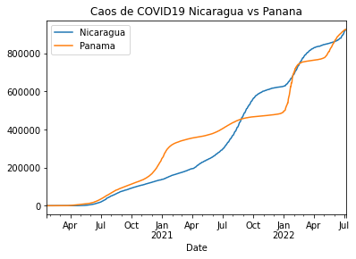
    


## Ahora llamamos todos los objetos creados para ver una grafica comparativa entre todos los paises centroaméricanos


```python
df_ca=pd.concat([casos_ni,casos_pa, casos_sv, casos_cr, casos_gt, casos_hn], axis=1) 
df_ca
```


<div>
<style scoped>
    .dataframe tbody tr th:only-of-type {
        vertical-align: middle;
    }

    .dataframe tbody tr th {
        vertical-align: top;
    }

    .dataframe thead th {
        text-align: right;
    }
</style>
<table border="1" class="dataframe">
  <thead>
    <tr style="text-align: right;">
      <th></th>
      <th>Cases</th>
      <th>Cases</th>
      <th>Cases</th>
      <th>Cases</th>
      <th>Cases</th>
      <th>Cases</th>
    </tr>
    <tr>
      <th>Date</th>
      <th></th>
      <th></th>
      <th></th>
      <th></th>
      <th></th>
      <th></th>
    </tr>
  </thead>
  <tbody>
    <tr>
      <th>2020-01-22 00:00:00+00:00</th>
      <td>0</td>
      <td>0</td>
      <td>0</td>
      <td>0</td>
      <td>0</td>
      <td>0</td>
    </tr>
    <tr>
      <th>2020-01-23 00:00:00+00:00</th>
      <td>0</td>
      <td>0</td>
      <td>0</td>
      <td>0</td>
      <td>0</td>
      <td>0</td>
    </tr>
    <tr>
      <th>2020-01-24 00:00:00+00:00</th>
      <td>0</td>
      <td>0</td>
      <td>0</td>
      <td>0</td>
      <td>0</td>
      <td>0</td>
    </tr>
    <tr>
      <th>2020-01-25 00:00:00+00:00</th>
      <td>0</td>
      <td>0</td>
      <td>0</td>
      <td>0</td>
      <td>0</td>
      <td>0</td>
    </tr>
    <tr>
      <th>2020-01-26 00:00:00+00:00</th>
      <td>0</td>
      <td>0</td>
      <td>0</td>
      <td>0</td>
      <td>0</td>
      <td>0</td>
    </tr>
    <tr>
      <th>...</th>
      <td>...</td>
      <td>...</td>
      <td>...</td>
      <td>...</td>
      <td>...</td>
      <td>...</td>
    </tr>
    <tr>
      <th>2022-07-03 00:00:00+00:00</th>
      <td>920294</td>
      <td>925254</td>
      <td>169646</td>
      <td>904934</td>
      <td>920294</td>
      <td>427718</td>
    </tr>
    <tr>
      <th>2022-07-04 00:00:00+00:00</th>
      <td>921146</td>
      <td>925254</td>
      <td>169646</td>
      <td>904934</td>
      <td>921146</td>
      <td>427718</td>
    </tr>
    <tr>
      <th>2022-07-05 00:00:00+00:00</th>
      <td>922340</td>
      <td>925254</td>
      <td>169646</td>
      <td>904934</td>
      <td>922340</td>
      <td>427718</td>
    </tr>
    <tr>
      <th>2022-07-06 00:00:00+00:00</th>
      <td>927473</td>
      <td>925254</td>
      <td>169646</td>
      <td>904934</td>
      <td>927473</td>
      <td>427718</td>
    </tr>
    <tr>
      <th>2022-07-07 00:00:00+00:00</th>
      <td>927473</td>
      <td>925254</td>
      <td>169646</td>
      <td>904934</td>
      <td>927473</td>
      <td>427718</td>
    </tr>
  </tbody>
</table>
<p>898 rows × 6 columns</p>
</div>


```python
df_ca.columns= ['Nicaragua','Costa Rica','Honduras','Guatemala','El Salvador','Panamá']
df_ca
```


<div>
<style scoped>
    .dataframe tbody tr th:only-of-type {
        vertical-align: middle;
    }

    .dataframe tbody tr th {
        vertical-align: top;
    }

    .dataframe thead th {
        text-align: right;
    }
</style>
<table border="1" class="dataframe">
  <thead>
    <tr style="text-align: right;">
      <th></th>
      <th>Nicaragua</th>
      <th>Costa Rica</th>
      <th>Honduras</th>
      <th>Guatemala</th>
      <th>El Salvador</th>
      <th>Panamá</th>
    </tr>
    <tr>
      <th>Date</th>
      <th></th>
      <th></th>
      <th></th>
      <th></th>
      <th></th>
      <th></th>
    </tr>
  </thead>
  <tbody>
    <tr>
      <th>2020-01-22 00:00:00+00:00</th>
      <td>0</td>
      <td>0</td>
      <td>0</td>
      <td>0</td>
      <td>0</td>
      <td>0</td>
    </tr>
    <tr>
      <th>2020-01-23 00:00:00+00:00</th>
      <td>0</td>
      <td>0</td>
      <td>0</td>
      <td>0</td>
      <td>0</td>
      <td>0</td>
    </tr>
    <tr>
      <th>2020-01-24 00:00:00+00:00</th>
      <td>0</td>
      <td>0</td>
      <td>0</td>
      <td>0</td>
      <td>0</td>
      <td>0</td>
    </tr>
    <tr>
      <th>2020-01-25 00:00:00+00:00</th>
      <td>0</td>
      <td>0</td>
      <td>0</td>
      <td>0</td>
      <td>0</td>
      <td>0</td>
    </tr>
    <tr>
      <th>2020-01-26 00:00:00+00:00</th>
      <td>0</td>
      <td>0</td>
      <td>0</td>
      <td>0</td>
      <td>0</td>
      <td>0</td>
    </tr>
    <tr>
      <th>...</th>
      <td>...</td>
      <td>...</td>
      <td>...</td>
      <td>...</td>
      <td>...</td>
      <td>...</td>
    </tr>
    <tr>
      <th>2022-07-03 00:00:00+00:00</th>
      <td>920294</td>
      <td>925254</td>
      <td>169646</td>
      <td>904934</td>
      <td>920294</td>
      <td>427718</td>
    </tr>
    <tr>
      <th>2022-07-04 00:00:00+00:00</th>
      <td>921146</td>
      <td>925254</td>
      <td>169646</td>
      <td>904934</td>
      <td>921146</td>
      <td>427718</td>
    </tr>
    <tr>
      <th>2022-07-05 00:00:00+00:00</th>
      <td>922340</td>
      <td>925254</td>
      <td>169646</td>
      <td>904934</td>
      <td>922340</td>
      <td>427718</td>
    </tr>
    <tr>
      <th>2022-07-06 00:00:00+00:00</th>
      <td>927473</td>
      <td>925254</td>
      <td>169646</td>
      <td>904934</td>
      <td>927473</td>
      <td>427718</td>
    </tr>
    <tr>
      <th>2022-07-07 00:00:00+00:00</th>
      <td>927473</td>
      <td>925254</td>
      <td>169646</td>
      <td>904934</td>
      <td>927473</td>
      <td>427718</td>
    </tr>
  </tbody>
</table>
<p>898 rows × 6 columns</p>
</div>


```python
df_ca.plot(title="Comparativa del COVID19 Centroamerica", logy=True)
```


    <AxesSubplot:title={'center':'Comparativa del COVID19 Centroamerica'}, xlabel='Date'>


    
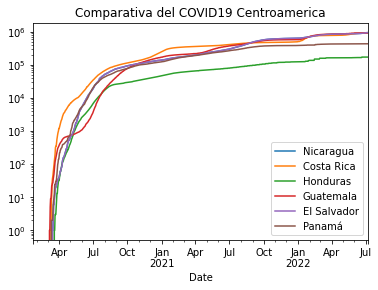
    


El grafico que obtuvimos al plotear todos los países de Centroamérica, podemos ver el comportamiento del virus desde el 2021 hasta julio del 2022. 
Según los datos reportados, Honduras y Panamá serian los países menos afectados por el virus. Mientras que Costa Rica, Guatemala y El Salvador parecen ser los más afectados. 
También vemos que hay una falta de data en Nicaragua, por lo que no se puede determinar la evolución de la enfermedad en este país. 


```python

```
